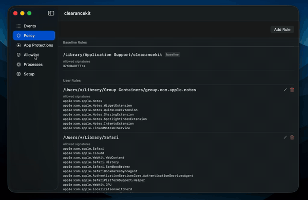
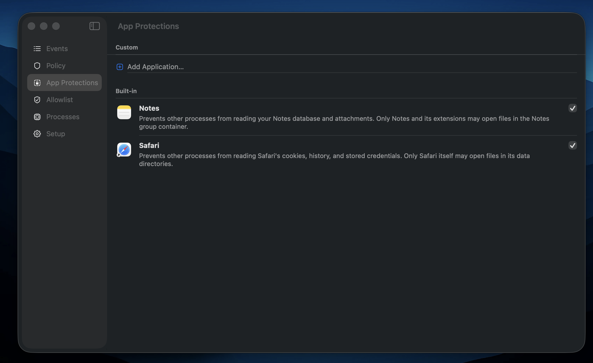

# ClearanceKit

ClearanceKit monitors file system activity and enforces per-process allow/deny policies on macOS. It surfaces deny events from the Endpoint Security framework in a native SwiftUI interface, letting you build and refine policies without writing configuration files.

It also supports process ancestry checking as part of these policies, which allows policies that allow sub-processes that are typical 'living off the land' tools. Note that policies with ancestry checks is more resource intensive so it is recommended to scope paths as tightly as possible. 





## Installation

Download the latest DMG from the [Releases](../../releases) page, open it, and drag clearancekit to Applications.

On first launch you will be prompted to activate the system extension and grant Full Disk Access — both are required for Endpoint Security to function.

## Architecture

Two components work together:

- **clearancekit.app** — SwiftUI menu bar app. Manages policies, displays live events, and communicates with the system extension over XPC.
- **uk.craigbass.clearancekit.opfilter** — System extension (Endpoint Security). Intercepts `ES_EVENT_TYPE_AUTH_OPEN` events, evaluates policies, and serves the GUI over XPC.

## Development

### Prerequisites

- Xcode 26+
- Apple Developer account with the **Endpoint Security** entitlement approved for your team ID
- Developer ID provisioning profiles for both `uk.craigbass.clearancekit` and `uk.craigbass.clearancekit.opfilter`

### First run

1. Build and run the app (Cmd+R)
2. Open the **Setup** tab and click **Activate Extension** — macOS prompts for approval in System Settings (once only)
3. Grant Full Disk Access to the system extension when prompted

### Attaching the debugger

Use **Debug → Attach to Process by PID or Name** and enter `uk.craigbass.clearancekit.opfilter`. Note that attaching to an ES client can cause watchdog timeouts; `ES_OSLOG_LEVEL=debug` logging is a lower-overhead alternative.

## Troubleshooting

Check system extension state:

```
systemextensionsctl list
```

View extension logs:

```
log stream --predicate 'subsystem == "uk.craigbass.clearancekit.opfilter"' --level debug
```
